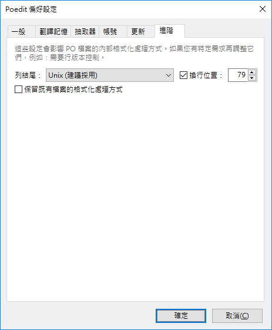

# FreeBSD 使用手冊 (繁體中文)

FreeBSD 文件計劃開始採用 GNU gettext 的方式來執行翻譯，GNU gettext 做為翻譯工具已相當成熟且已有許多可支援線上協同翻譯的平台，這解決了原採用 Docbook 格式無法同步最新的原文翻譯文件以及多人共同翻譯的問題。
但要採用 GNU gettext 的模式必須先將既有採用 Docbook 的文件內容轉移至 PO 檔，否則無法並存，本專案目標解決以下幾個問題：

- [x] 將既有 Docbook 格式轉換為 GNU gettext 的 PO 格式以讓未來可以有更多人可參與翻譯工作
- [X] 同步及匯整舊有翻譯至最新的原文翻譯版本以跟上目前的文件版本
  - [X] 4. 軟體套件管理篇：Packages 及 Ports 機制
  - [X] 9. 列印
  - [X] 14. Jails
  - [X] 17. 儲存設備篇
  - [X] 10. Linux® 二進位檔的相容性
  - [X] 21. Virtualization(虛擬機器)
  - [X] 29. 防火牆
- [X] 統整文件內目錄標題以及相關名詞
- [X] 完成 Part 1 翻譯
- [ ] 完成 Part 3 翻譯
  - [X] 19. Z 檔案系統 (ZFS)
  - [X] 11. 設定與調校
  - [X] 12. FreeBSD 開機程序
  - [X] 23. 更新與升級 FreeBSD
    - [X] 23.6. 重新編譯 World
  - [ ] 13. 安全性
    - [X] 13.3. 一次性密碼
    - [X] 13.8. OpenSSH
    - [ ] 13.10. 監視第三方安全性問題
    - [X] 13.14. 使用 Sudo 分享管理權限
  - [ ] 24. DTrace
- [ ] 完成 Part 4 翻譯
  - [ ] 26. PPP
    - [ ] 26.4. 在乙太網路使用 PPP (PPPoE)
  - [ ] 28. 網路伺服器
    - [X] 28.8. Apache HTTP 伺服器
    - [X] 28.9. 檔案傳輸協定 (FTP)
    - [X] 28.10. Microsoft® Windows® 用戶端檔案與列印服務 (Samba)
    - [X] 28.11. NTP 時間校對
  - [ ] 30. 進階網路設定
    - [ ] 30.1. 概述
    - [ ] 30.2. 通訊閘與路由
    - [ ] 30.3. 無線網路
- [ ] 完成 Part 2 翻譯
  - [ ] 7.2. 設定音效卡
  - [ ] 7.4. 影片播放
  

# 如何參與翻譯?
* [FreeBSD Handbook - EN](https://www.freebsd.org/doc/en_US.ISO8859-1/books/handbook/) 為操作手冊原文
* [book.html](book.html) 為採用 GNU gettext 翻譯所產生的新版文件
* [book.ori.html](book.ori.html) 為舊版本用 Docbook 翻譯所產生的舊版文件
* [zh_TW.po](zh_TW.po) 為 GNU gettext 的翻譯檔
* [book.xml](book.xml) 為使用 GNU gettext 翻譯檔所產生的 Docbook 文件


己完成: ~~第一階段目標是將既有的舊版翻譯移植至 GNU gettext 的 PO 格式，舊版翻譯請參考 [book.ori.html](book.ori.html)。
由於 PO 檔所參照是最新版本的原文，因此，若舊有譯文與新版原有出入之部份需要予以修正，需盡可能保留先前翻譯人員的成果。~~

欲協助翻譯的人員可使用 Github Fork 這個專案，並使用 PO 檔編輯器翻譯 [zh_TW.po](zh_TW.po)，翻譯完的結果可利用 Pull Request 提交給我做合併，最後合併完的版本會統一提交至 FreeBSD Documentation Project。

要查看轉文成文件的翻譯成果可將所有檔案以 zip 格式下載至電腦並使用瀏覽器開啟 book.html。

# 官方文件
https://www.freebsd.org/doc/en_US.ISO8859-1/books/fdp-primer/po-translations.html

# 建立翻譯環境
https://www.freebsd.org/doc/en/books/fdp-primer/po-translations-quick-start.html
```
# 安裝翻譯工具
pkg install docproj subversion

# 下載最新文件
svn checkout https://svn.FreeBSD.org/doc/head ~/doc
cd ~/doc/zh_TW.UTF-8/books/handbook/

# 建立翻譯檔 zh_TW.po
make po 

# 翻譯
poedit zh_TW.po

# 產生翻譯結果 book.xml
make tran

# 將 book.xml 轉為 html
make FORMATS=html
```

# PO 檔編輯器

##### Windows, Mac OS X
https://poedit.net/
##### Ubuntu
```
apt-get install poedit
```
##### FreeBSD
```
pkg install poedit
```
#### 設定
若您是使用 POEdit 編輯，請記得做以下設定：
1. 取消"勺選保留既有檔案的格式化處理方式"
2. 換行位置設為 79 並採用 Unix 列結尾


# 翻譯名詞對照表
| 原文  | 譯文 | 使用章節 |
| ------------- | ------------- | ------------ |
| Committer | 提交者 ||
| Audit | 稽查 | |
| Disk | 磁碟 ||
| Drive | 磁碟機 ||
| Device | 裝置 ||
| CD-ROM, DVD Drive | CD-ROM, DVD 光碟機 ||
| Mount | 掛載 ||
| Unmount | 卸載 ||
| Home directory | 家目錄 ||
| Signal | 信號 ||
| Common Address Redundancy Protocol | 共用位址備援協定 |||
| Line Printer | 行列式印表機 ||
| Serial | 序列 ||
| Spool, Spooling | 緩衝, 暫存 (需附註原文) ||
| Script | (不翻譯) ||
| Log | 日誌 (需附註原文) ||
| System call | 系統呼叫 (需附註原文) ||
| Slice | 切割區 | 同 Windows 的 Partition (分割區) |
| Slice Partition | 切割區分區 | 與 Windows 的 Partition 不同, 是 Slice 底下再分出來的 |
| Partition | 分割區 | 同 FreeBSD 的 Sliace (切割區) |
| Partitioning | 磁碟分割 ||
| Partitioning scheme | 分割表格式 | 例如 MBR, GPT 等 |
| third-party software | 第三方軟體 ||
| Volume | 磁碟區 ||
| Block, Block size, Bad block | 區塊, 資料區塊, 磁碟區塊 ||
| Swap Space | 交換空間 ||
| Ports Collection | TBD, Ports 套件集 ||
| Binary Package | TBD, Binary 套件 ||
| Base System | TBD ||
| Package | TBD, 套件 ||
| Journaling | TBD | |
| Shell | (不翻譯) ||
| Daemon | (不翻譯) ||
| Console | (不翻譯) ||
| Binary | (不翻譯) ||
| Plugin | 附加元件 ||
| Productivity Tools | 辦工工具 ||
| Repository | 檔案庫 ||
| Video Cards | 顯示卡 ||
| Video | 影像 ||
| Monitors | 顯示器 ||
| Chipsets | 晶片組 ||
| Mixer Channels | 混音器頻道 ||
| Ripping | 擷取 ||
| Audio Tracks | 音軌 ||
| Library, Libraries | 程式庫 | |
| Log Rotation | 日誌翻轉 ||
| Bandwidth Delay Product | 頻寬延遲乘積 ||
| Suspend, Hibernate, Resume | 待機, 休眠, 喚醒 ||
| System Hangs | TBD, 系統無回應 ||
| Tuning | 調校 ||
| Process Accounting | 程序追蹤 ||
| Policy | 政策, 管理政策 ||
| Scrubbing | 清潔 | ZFS |
| Pool, Storage Pool | 儲存池 | ZFS |
| Snapshot | 快照 |  |
| Considerations | 注意事項 | |
| NAT, Network Address Translation | 網路位址轉譯 ||
| Failover | 容錯移轉 ||
| Manual Page | 操作手冊 ||
| Host OS | 主端作業系統 ||
| Guest OS | 客端作業系統 ||
| Distribution | 發行版 | 用來發行用的版本 |
| Release | 發佈, 發佈版 | |
| Command prompt | 指令提示 |
| Command line | 指令列 |
| Permission Set | 權限集 | 泛指讀取、寫入、執行等權限 |
| Dangerously dedicated | 危險專用 | 磁碟中無 slice 的 partition |
| Stripe, Striping | 串連 | RAID, ZFS |
| Mirror, Mirroring | 鏡像 | RAID, ZFS |
| Fault | 故障 | RAID, ZFS |
| Fail | 失效 | RAID, ZFS |
| Parity | 奇偶校驗 | RAID, ZFS |
| Checksum | 校驗碼, 資料校驗 | RAID, ZFS | 
| Gateway | 通訊閘 | 網路 |
# PO 線上協同翻譯平台
* https://hosted.weblate.org/
* https://translatewiki.net/
* https://www.transifex.com/
